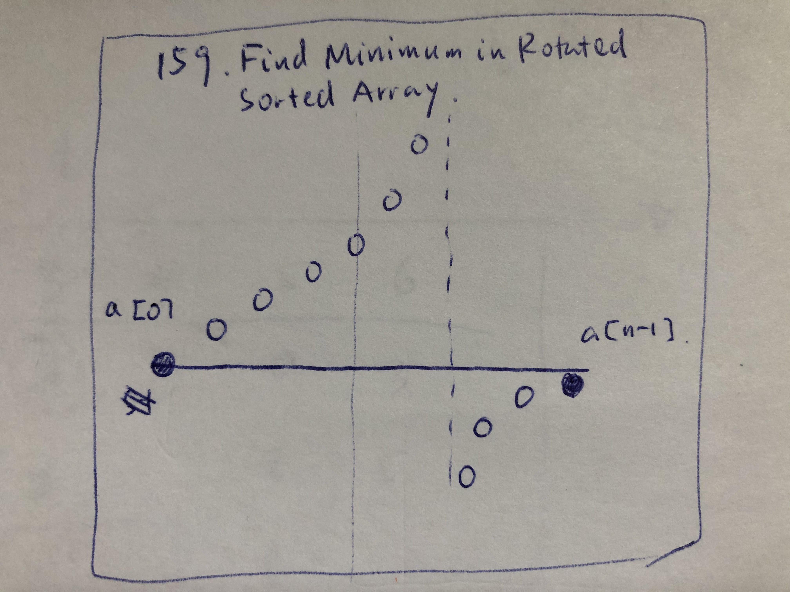

# Binary Search

## Type 1: Binary Search for Answers

### LinkCode 617: Maximum Average Subarray II

_\[A Very Classic Question\]_

Given an array with positive and negative numbers, find the `maximum average subarray` which length should be greater or equal to given length `k`.


 It's guaranteed that the size of the array is greater or equal to _k_.


#### Example

Example 1:

```text
Input:
[1,12,-5,-6,50,3]
3
Output:
15.667
Explanation:
 (-6 + 50 + 3) / 3 = 15.667
```

Example 2:

```text
Input:
[5]
1
Output:
5.000
```

#### Logic:

* We are going to find whether **an attempting answer** `T` ****will be **feasible**, which is the essential intuition of _**Binary Search for Answers**_
* Say we aim to find if `T` is feasible, then within `j - i + 1 >= k`, we shall have:

$$
\frac{a_i + ... + a_j}{j+i-1} = \frac{\sum_{n=i}^{j} a_n }{ j-i+1} \geq T
$$

* According to the equation above, if we subtract `T` on both sides:

$$
\frac{(a_i - T)+ ... + (a_j - T)}{j+i-1} = \frac{\sum_{n=i}^{j} (a_n-T) }{ j-i+1} \geq 0
$$

* Now denote `b[i] = a[i] - T`, then within `j - i + 1 >= k`, we wish to find the **maximum subarray sum**:

$$
b_i + ... + b_j= \sum_{n=i}^{j} b_n \geq 0
$$

* This can be easily achieved by using prefix sum:
  * If we can find the maximum subarray sum &gt;= 0, attemption is successful
  * Otherwise the attemption is failed
  * In detail, check the equation below to calculate `MaxSubarraySum[i]`, and finally get the maximum one among `k<= i <= n`:

$$
MaxSubarraySum_i=S_i - min(S_0, S_1, ..., S_{i-k+1})
\\
where, S_i \triangleq S_0 + S_1 + ... + S_{i-1}
$$

* Note, how to determine the answers' `start` and `end` choices?
  * Since `start` is the minimum average, which is the minimum value among the array
  * Similarly, `end` shall be the maximum value among the array

#### Sample code:


```cpp
class Solution {
public:
    // Note: the essential process is based on "double" type
    bool isTValFeasible(vector<int>& nums, int n, int k, double T)
    {
        // def: pfsum[k] = a[0] + a[1] + ... + a[k-1]
        vector<double> pfsum(n+1, 0.0);
        
        for (int i = 0; i < n; i++)
            pfsum[i+1] = pfsum[i] + nums[i] - T;

        double min_pfval = pfsum[0]; // minimum pfsum value beyond k distance to i
        // this strategy guarantees that there're at least k elements' sum
        for (int i = k; i <= n; i++)
        {
            min_pfval = min(min_pfval, pfsum[i-k]);
            double possible_max_val = pfsum[i] - min_pfval;
            
            if (possible_max_val >= 0)
                return true;
        }
        return false;
    }
    /**
     * @param nums: an array with positive and negative numbers
     * @param k: an integer
     * @return: the maximum average
     */
    double maxAverage(vector<int> &nums, int k) {
        // write your code here
        int start = INT_MAX, end = INT_MIN;
        int n = nums.size();

        for (int i = 0; i < n; i++)
        {
            start = min(start, nums[i]);
            end   = max(end,   nums[i]);
        }

        double thres = 0.00001;
        double s = start, e = end;
        while (e - s > thres)
        {
            double mid = s + (e - s) / 2;
            if (isTValFeasible(nums, n, k, mid))
                s = mid;
            else
                e = mid;
        }
        
        return s;
    }
};
```


## Type 2: Rotated Arrays

### LintCode 159: Find Minimum in Rotated Sorted Array

Suppose a sorted array in ascending order is rotated at some pivot unknown to you beforehand.

\(i.e., `0 1 2 4 5 6 7` might become `4 5 6 7 0 1 2`\).

Find the minimum element.


 You can assume no duplicate exists in the array.


**Example 1:**

```text
Input：[4, 5, 6, 7, 0, 1, 2]
Output：0
Explanation：
The minimum value in an array is 0.
```

**Example 2:**

```text
Input：[2,1]
Output：1
Explanation：
The minimum value in an array is 1.
```

#### Logic:

* Always compare to the front value `a[0]` and end value `a[n-1]`
* A corner case: there's NO rotation in the given array, then just simply return `a[0]`

#### 



#### Sample code:


```cpp
class Solution {
public:
    /**
     * @param nums: a rotated sorted array
     * @return: the minimum number in the array
     */
    int findMin(vector<int> &nums) {
        int n = nums.size();
        if (n == 1)
            return nums[0];
        int start = 0, end = n - 1;
        
        // corner case: if there's no rotation, return nums[0]
        if (nums[0] < nums[n-1])
            return nums[0];

        while (start + 1 < end)
        {
            int mid = (start + end) / 2;
            
            if (nums[mid] >= nums[0])
                start = mid;
            else if (nums[mid] <= nums[n-1])
                end = mid;
            // otherwise, nums[mid] < nums[0] && nums[mid] > nums[n-1], impossible
        }

        if (nums[start] < nums[end])
            return nums[start];
        else
            return nums[end];
    }
};
```


