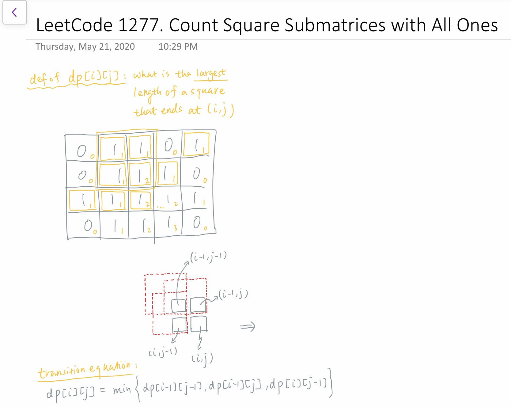

# Dynamic Programming

## Type 1: Simple DP

### LeetCode 1277. Count Square Matrices with All Ones

Given a `m * n` matrix of ones and zeros, return how many **square** submatrices have all ones.

**Example 1:**

```text
Input: matrix =
[
  [0,1,1,1],
  [1,1,1,1],
  [0,1,1,1]
]
Output: 15
Explanation: 
There are 10 squares of side 1.
There are 4 squares of side 2.
There is  1 square of side 3.
Total number of squares = 10 + 4 + 1 = 15.
```

**Example 2:**

```text
Input: matrix = 
[
  [1,0,1],
  [1,1,0],
  [1,1,0]
]
Output: 7
Explanation: 
There are 6 squares of side 1.  
There is 1 square of side 2. 
Total number of squares = 6 + 1 = 7.
```

**Constraints:**

* `1 <= arr.length <= 300`
* `1 <= arr[0].length <= 300`
* `0 <= arr[i][j] <= 1`

#### Logic:

* Simply apply dp to loop everything once, take the following picture as the intuition:



#### Sample code:


```cpp
class Solution {
public:
    int countSquares(vector<vector<int>>& matrix) {
        if (matrix.size() == 0 || matrix[0].size() == 0)
            return 0;
        int m = matrix.size(), n = matrix[0].size();

        vector<vector<int>> dp(m, vector<int>(n, 0));
        int res = 0;
        for (int i = 0; i < m; i++)
        {
            for (int j = 0; j < n; j++)
            {
                if (i == 0 || j == 0)
                    dp[i][j] = matrix[i][j];
                else
                {
                    if (matrix[i][j] == 1)
                        dp[i][j] = min(min(dp[i-1][j-1], dp[i-1][j]), dp[i][j-1]) + 1;
                }
                res += dp[i][j];
            }
            
        }

        return res;
    }
};
```



