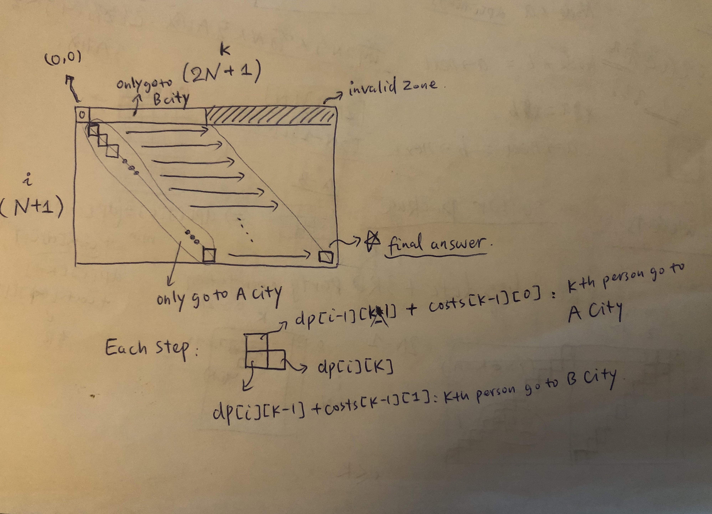
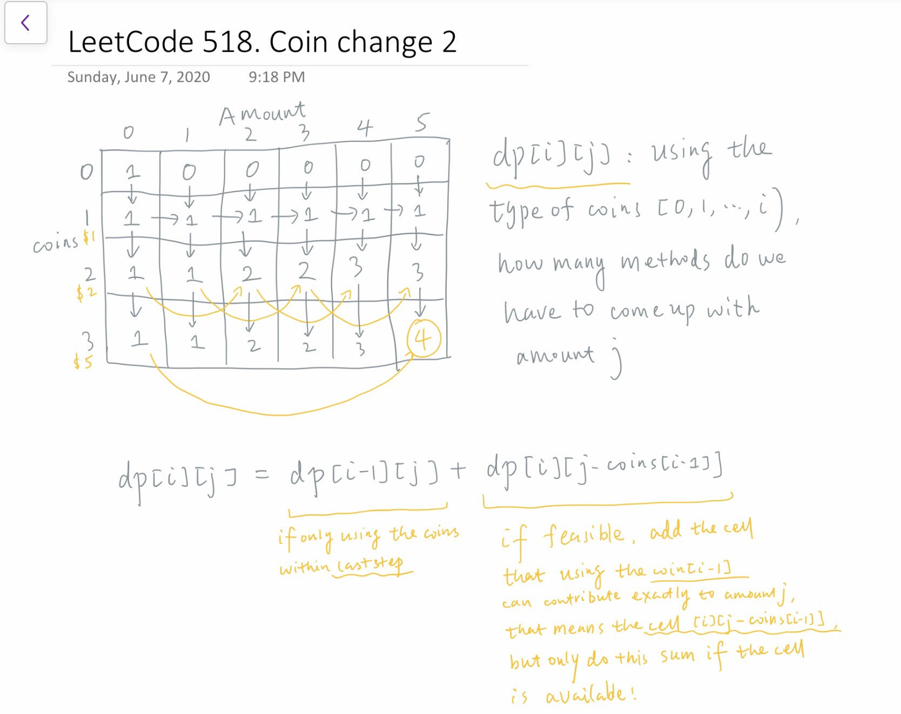

# Dynamic Programming

## Type 1: Simple DP

### LeetCode 1277. Count Square Matrices with All Ones

Given a `m * n` matrix of ones and zeros, return how many **square** submatrices have all ones.

**Example 1:**

```text
Input: matrix =
[
  [0,1,1,1],
  [1,1,1,1],
  [0,1,1,1]
]
Output: 15
Explanation: 
There are 10 squares of side 1.
There are 4 squares of side 2.
There is  1 square of side 3.
Total number of squares = 10 + 4 + 1 = 15.
```

**Example 2:**

```text
Input: matrix = 
[
  [1,0,1],
  [1,1,0],
  [1,1,0]
]
Output: 7
Explanation: 
There are 6 squares of side 1.  
There is 1 square of side 2. 
Total number of squares = 6 + 1 = 7.
```

**Constraints:**

* `1 <= arr.length <= 300`
* `1 <= arr[0].length <= 300`
* `0 <= arr[i][j] <= 1`

#### Logic:

* Simply apply dp to loop everything once, take the following picture as the intuition:


#### Sample code:


```cpp
class Solution {
public:
    int countSquares(vector<vector<int>>& matrix) {
        if (matrix.size() == 0 || matrix[0].size() == 0)
            return 0;
        int m = matrix.size(), n = matrix[0].size();

        vector<vector<int>> dp(m, vector<int>(n, 0));
        int res = 0;
        for (int i = 0; i < m; i++)
        {
            for (int j = 0; j < n; j++)
            {
                if (i == 0 || j == 0)
                    dp[i][j] = matrix[i][j];
                else
                {
                    if (matrix[i][j] == 1)
                        dp[i][j] = min(min(dp[i-1][j-1], dp[i-1][j]), dp[i][j-1]) + 1;
                }
                res += dp[i][j];
            }
            
        }

        return res;
    }
};
```


### LeetCode 1029. Two City Scheduling

There are `2N` people a company is planning to interview. The cost of flying the `i`-th person to city `A` is `costs[i][0]`, and the cost of flying the `i`-th person to city `B` is `costs[i][1]`.

Return the minimum cost to fly every person to a city such that exactly `N` people arrive in each city.

**Example 1:**

```text
Input: [[10,20],[30,200],[400,50],[30,20]]
Output: 110
Explanation: 
The first person goes to city A for a cost of 10.
The second person goes to city A for a cost of 30.
The third person goes to city B for a cost of 50.
The fourth person goes to city B for a cost of 20.

The total minimum cost is 10 + 30 + 50 + 20 = 110 to have half the people interviewing in each city.
```

**Note:**

1. `1 <= costs.length <= 100`
2. It is guaranteed that `costs.length` is even.
3. `1 <= costs[i][0], costs[i][1] <= 1000`

Logic:

* Dynamic programming is good way to handle this situation
* Need to carefully design the initialization and loop order as shown below



#### Sample Code:


```cpp
class Solution {
public:
    int twoCitySchedCost(vector<vector<int>>& costs) {
        int N = costs.size() / 2;
        // dp[i][k]: to assign i persons to A city within k persons, what is the minimum cost
        vector<vector<int>> dp(N+1, vector<int>(2*N+1, 0));

        // initialization
        for (int i = 1; i <= N; i++) {
            dp[0][i] = costs[i-1][1] + dp[0][i-1];           // only assigning persons to B city 
            dp[i][i] = costs[i-1][0] + dp[i-1][i-1];         // only assigning persons to A city
        }

        for (int i = 1; i <= N; i++) {
            for (int k = i+1; k <= i+N; k++) {
                dp[i][k] = min(dp[i-1][k-1] + costs[k-1][0], // the k-th person will go to A city
                               dp[i][k-1] + costs[k-1][1]);  // the k-th person will go to B city
            }
        }

        return dp[N][2*N];
    }
};
```


## Type 2: Two-Sequence

### LeetCode 1143. Longest Common Subsequence

Given two strings `text1` and `text2`, return the length of their longest common subsequence.

A _subsequence_ of a string is a new string generated from the original string with some characters\(can be none\) deleted without changing the relative order of the remaining characters. \(eg, "ace" is a subsequence of "abcde" while "aec" is not\). A _common subsequence_ of two strings is a subsequence that is common to both strings.

If there is no common subsequence, return 0.

**Example 1:**

```text
Input: text1 = "abcde", text2 = "ace" 
Output: 3  
Explanation: The longest common subsequence is "ace" and its length is 3.
```

**Example 2:**

```text
Input: text1 = "abc", text2 = "abc"
Output: 3
Explanation: The longest common subsequence is "abc" and its length is 3.
```

**Example 3:**

```text
Input: text1 = "abc", text2 = "def"
Output: 0
Explanation: There is no such common subsequence, so the result is 0.
```

**Constraints:**

* `1 <= text1.length <= 1000`
* `1 <= text2.length <= 1000`
* The input strings consist of lowercase English characters only.

#### Logic:

* Use dynamic programming to describe the matching process
  * `dp[i][j]` represents: within the front `i` letters of `text1`, and front `j` letters of `text2` what is the longest common subsequence
  * with the `dp` definition above, we need to have `m+1` and `n+1` as the size of the `dp` 


```cpp
class Solution {
public:
    int longestCommonSubsequence(string text1, string text2) {
        int m = text1.size(), n = text2.size();
        
        // dp[i][j]: within the front i letters of text1, and front j letters of text2
        //           what is the longest common subsequence
        vector<vector<int>> dp(m+1, vector<int>(n+1, 0));
        
        for (int i = 1; i <= m; i++)
        {
            for (int j = 1; j <= n; j++)
            {
                dp[i][j] = max(dp[i-1][j], dp[i][j-1]);
                if (text1[i-1] == text2[j-1])
                    dp[i][j] = max(dp[i][j], dp[i-1][j-1] + 1);
            }
        }
        
        return dp[m][n];
    }
};
```


#### Related Problems:

* [Max Dod Product of Two Subsequences](https://leetcode.com/problems/max-dot-product-of-two-subsequences/)
* [Uncrossed Lines](https://leetcode.com/problems/uncrossed-lines/)

### LeetCode 72. Edit Distance

Given two words _word1_ and _word2_, find the minimum number of operations required to convert _word1_ to _word2_.

You have the following 3 operations permitted on a word:

1. Insert a character
2. Delete a character
3. Replace a character

**Example 1:**

```text
Input: word1 = "horse", word2 = "ros"
Output: 3
Explanation: 
horse -> rorse (replace 'h' with 'r')
rorse -> rose (remove 'r')
rose -> ros (remove 'e')
```

**Example 2:**

```text
Input: word1 = "intention", word2 = "execution"
Output: 5
Explanation: 
intention -> inention (remove 't')
inention -> enention (replace 'i' with 'e')
enention -> exention (replace 'n' with 'x')
exention -> exection (replace 'n' with 'c')
exection -> execution (insert 'u')
```

#### Logic:

* Use dynamic programming to simplify the operations
  * `dp[i][j]` represents: within `word1[0, ..., i)` and `word2[0, ..., j)` how many operations have to been done to make them same
  * with the `dp` definition above, we need to have `m+1` and `n+1` as the size of the `dp`
  * must initialize `dp[i][0] = i` and `dp[0][j] = j`

## Type 3: Backpack DP

### LeetCode 518. Coin Change 2


You are given coins of different denominations and a total amount of money. Write a function to compute the number of combinations that make up that amount. You may assume that you have infinite number of each kind of coin.

* 
**Example 1:**

```text
Input: amount = 5, coins = [1, 2, 5]
Output: 4
Explanation: there are four ways to make up the amount:
5=5
5=2+2+1
5=2+1+1+1
5=1+1+1+1+1
```

**Example 2:**

```text
Input: amount = 3, coins = [2]
Output: 0
Explanation: the amount of 3 cannot be made up just with coins of 2.
```

**Example 3:**

```text
Input: amount = 10, coins = [10] 
Output: 1
```

**Note:**

You can assume that

* 0 &lt;= amount &lt;= 5000
* 1 &lt;= coin &lt;= 5000
* the number of coins is less than 500
* the answer is guaranteed to fit into signed 32-bit integer

#### Logic:

* Do the 3-step: DFS -&gt; memoized search -&gt; DP
* Actually, the memoized search here is trying to store DFS intermediate variable, but DP is more bottom-up strategy that has few similarities with memoized search
* A picture for DP is shown for reference



#### Sample Code:


```cpp
class Solution {
public:
    // Method 1: DFS (TLE)
    void dfs(int amount, vector<int>& coins, int i, int& cnt) {
        if (amount <= 0) {
            cnt += amount == 0;
            return;
        }
        for (int j = i; j < coins.size(); j++) {
            dfs(amount - coins[j], coins, j, cnt);
        }
    }
    
    int change(int amount, vector<int>& coins) {
        int cnt = 0;
        dfs(amount, coins, 0, cnt);
        return cnt;
    }
    
    // Method 2: Memorized Search (AC)
    int dfs(int amount, vector<int>& coins, int i, vector<vector<int>>& memo) {
        if (amount <= 0)  return amount == 0;
        if (memo[amount][i] > -1) return memo[amount][i];
        int cnt = 0;
        for (int j = i; j < coins.size(); j++) {
            cnt += dfs(amount - coins[j], coins, j, memo);
        }
        memo[amount][i] = cnt;
        return cnt;
    }
    
    int change(int amount, vector<int>& coins) {
        if (coins.size() == 0) return amount == 0;
        int n = coins.size();
        // memo[i][j]: methods to achieve i amount of money using coins within kinds [j, ..., n-1]
        vector<vector<int>> memo(amount+1, vector<int>(n, -1));
        return dfs(amount, coins, 0, memo);
    }

    // Method 3: DP (AC)
    int change(int amount, vector<int>& coins) {
        int n = coins.size();
        vector<vector<int>> dp(n+1, vector<int>(amount+1, 0));
        dp[0][0] = 1;
        for (int i = 1; i <= n; i++) {
            for (int j = 0; j <= amount; j++) {
                dp[i][j] += dp[i-1][j];
                if (j >= coins[i-1]) {
                    dp[i][j] += dp[i][j-coins[i-1]];
                }
            }
        }
        return dp[n][amount];
    }
};
```


